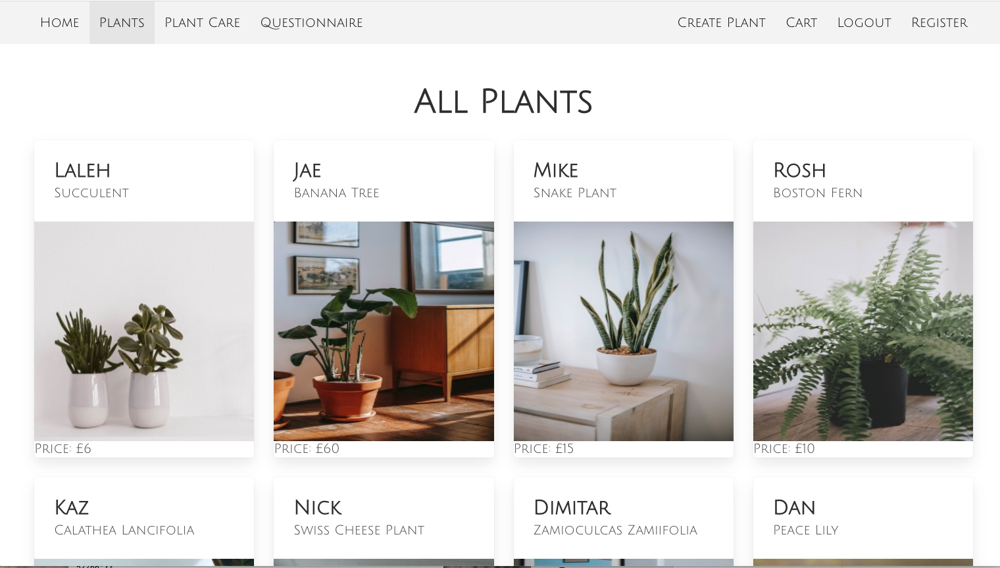

#  Shoe Drip 
### Developers
Roshanak Ahmed, Robyn Smith, Jaewon Han, and Jeanzle Albalte

### Deployed Project
https://isnt-wodnjsd-awesome.netlify.app/ 

## Brief
In a group of four, we were asked to collaboratively build a full-stack MERN app in two weeks, with our own backend and frontend, and deploy it online with a git repository hosted on GitHub. It was required of us to use a RESTful Express API to serve our data from a Mongo database and consume that API with a separate frontend built with React. We were required to implement wireframes and establish core MVP features.

## Overview
This is an E-commerce React app project that sells plants. The developers built a plant API with back-end endpoints and connected it to React routes on a front-end proxy server. 

Additional components were created such as the Home page. Customers can also register user accounts and log into the website on the Register and Login pages. Users then have the option to logout of their accounts.

The Plants page shows all the plants from the API. When each individual plant is clicked on, users can see all the individual plant data from the API on a new page. The API data is inspired by PatchPlants.com.

Logged in users have the option to add comments reviewing each plant. On the backend, the logged in users receive a token that enables them to have access to this feature. Users may also add plants to their Cart. The admin user is the only user given the option to create new plants and delete existing plants on the Plant page.

The Questionnaire tab allows users to take a survey and find out which plant type best suits them.

I was in charge of the Plant Care page. The Plant Care page embeds YouTube videos and links external articles on plant care tips. Users have the options to learn about Indoor Plants and Outdoor Plants. I read the official node package master documentation to embed videos on the Plant Care pages.

I also had the responsibility of creating the navbar MVP goals so that users could navigate all the tabs on each page and visit specific URLs for each component. My group and I collaborated on adding the navbar stretch goal logout button on the navbar after. I created URLs for the various components that I included in the navbar and app file. I also ensured that each plant would have its own URL based on its plant ID:

# 

I was in charge of creating the login and registration pages on the frontend, using Bulma to style the forms, and I included validation errors.

Furthermore, I collected README materials and wrote up the general README for the group. In addition, I was in charge of writing up several user stories and reviewing all the user stories that other group members wrote. I was also in charge of creating plant data for 5 plants, and editing plant data descriptions that my group members created.

## Technologies Used
**Technologies**
- Miro and Jira for planning
- Excalidraw for whiteboarding
- Visual Studio Code to create product
- Terminal to install dependencies
- Command Line Tools to install dependencies
- npm-install to install dependencies
- Node.js for database seeding
- React for frontend development
- React-Modal-Video to embed a YouTube video on plant care
- React-Confetti to add confetti to checkout button
- React-Responsive-Carousel to add carousel of recent plant purchases  in home page
- Survey-React to create questionnaire
- API for frontend and backend development
- Insomnia to test our API
- JavaScript and JSX for frontend and backend development
- HTML for frontend development
- CSS for styling in frontend development
- Bulma to import CSS
- Google Fonts to import fonts for styling
- Pexels to collect images
- Cloudinary to upload images into URLs
- Netlify for frontend deployment
- Heroku for backend API deployment
- MongoDB and Mongo Atlas to have a working database to deploy on Heroku
- Github to host git repositories and deployed project links online 
- Chai, Supertest, and Mocha for testing

**Installation Instructions for Dependencies**
Install Dependencies on Backend:
- `npm i express`
- `npm i mongoose`
- `npm i express`
- `npm i express`
- `npm i jwswebtoken `
- `npm i validator `
- `npm i mongoose-hidden`
- `npm i express-mongo-sanitize`
- `npm i bcrypt`
- `npm i chai`
- `npm i mocha`
- `npm i supertest`

Install Dependencies on Frontend:
- `npm i react-modal-video`
- `npm i react-confetti`
- `npm i react-responsive-carousel`
- `npm i survey-react`

**Run Project**
  1. Terminal: run `mongod --dbpath ~/data/db`
  2. Backend: run `node db/seed.js`
  3. Backend: run `npm start`
  4. Frontend: run `npm i`
  5. Frontend: run `npm start`

## Approach Taken
We created an e-commerce site because we wanted to create an app with a real world application.

We used whiteboarding on Excalidraw to create the design and wireframes of the app first. We also created a table on Miro on which we outlined our plan, the components we would use, and the features of each component, as well as our models and schema. We also used Miro to plan our MVP goals, Stretch Goals, and polishing goals.

We used Jira to delegate tasks to the group collectively as well as individual team members. We planned our timelines for each Sprint and organized our MVP and stretch goals. We also used Jira to think about the needs of our users and write out our user stories.

We proceeded to create the backend Express API to serve our data from a Mongo database on Visual Studio Code. We tested our backend CRUD functionality on Insomnia. My teammate Robyn Smith also used Chai, Mocha, and Supertest to create testing for our backend.

We then created the frontend React app on Visual Studio Code and connected our API from the backend. We previewed our project on Mozilla. We registered and logged in users, added reviews, deleted plants, created new plants, added plants to our cart, logged out users, added a questionnaire, and embedded YouTube videos on plant care tips and.

I was in charge of completing the navbar MVP goals, registering and logging in users on the frontend, and creating the plant care components that embedded YouTube videos. I also was in charge of collecting the README materials and writing up the group’s README. I also worked on user stories and creating URLs under the app.js file on the frontend. I worked on the CSS file to create CSS for the plant care components and navbar. I chose a green and white theme to match the color scheme of our plant images.

We committed changes to our app often. When we experienced bugs, we checked our console on Mozilla to debug errors. We also regularly seeded our database on the backend to ensure there were no errors. 

I used Bulma for the plant care, navbar, login, and registration components to practice efficient time management skills and save time on the styling. This allowed me to focus on my other goals.

For the plant care pages, I wanted to add articles and videos because people respond to different modalities of learning. Some people learn better from reading. Reading also allows busy users to quickly skim through the content because not everyone has time to sit through several minutes of a video, especially in a world where users are used to watching short TikTok clips. We also recognized that some people may need visual and audio elements to receive information and that reading articles may be too dry. Therefore, I added video options as well.

In addition, I wanted to provide information on both indoor and outdoor plants. I created separate tabs and URLs for indoor and outdoor plants to keep the information organized. It was challenging to embed two videos in one page without breaking the code, and I resolved this bug by creating separate pages for each. I also created separate components for the embedded video code for both indoor plant and outdoor plant videos, because there were too many bugs when I was trying to incorporate additional code with the videos.

I ensured that the links to external articles in the plant care pages opened on new tabs so that users would not be directed away from our website:
# 

In the navbar, I kept the CSS clean and simple. We decided what the tabs we would add as a team during the planning stage when we created our user stories. We viewed other e-commerce websites to see what users need and decided what tabs we would add from there. I also added validation errors on the frontend of the login and registration pages so that users would know if they logged in or registered their information incorrectly. My group and I ensured only admin users can delete plants to prevent spam accounts from destroying the app.

My group and I thought of the following user stories when designing our website:

# 

I also ensured the components I worked on alone (navbar, plant care, login, and register) and with my group (plant index, plant show) used mobile-first design with Bulma CSS. The following screenshots reflect the view of an iPhone 12 Pro
# 
# 

## Screenshots
**Project Pitch Deck**
# 
# 

**Jira Board**
# 
# 

**User Stories**
# 

**Testing endpoints on Insomnia**
# 

**Embedded Project**
# 
# 
# 
# 
# 
# 
# 
# 

**Project Code** 
# 
# 

## Blockers and Wins
**Group Blockers**
We struggled to decide whether to use useState or a ternary for our logout button. We also overcame ensuring that the logout button only appears when a user is logged in.

In addition, we overcame ensuring that the Create Plant page and delete button only appear when the admin user is logged in.

Lastly, we ensured that logged in users can add plants to their cart and that all the plants they add will appear in their specific cart.

**Personal Blockers**
I could not fit both indoor and outdoor embedded videos in one page without my code breaking, and I resolved this by creating two separate URLs for indoor and outdoor plants. I also resolved creating paragraphs for our plant descriptions in the data.js file in the backend by using `\n` to break up paragraphs. 

 **Group Wins**
- Admin profile can add and delete plants (only admin account sees that option)
- Different users can add comments/reviews on plants
- Add plants to cart and checkout
- Logout Button
- Questionnaire to figure out which plant is for you
- Checkout Confetti
- Alert you have logged in or added to cart
- Every component (aside from the homepage component) uses mobile-first design

 **Personal Wins**
- Embedded YouTube video on Indoor & Outdoor Plant Care
- Navbar with URL name associated with each component tab we click on
- Navbar, plant care, login, and register components use mobile-first design with Bulma CSS

 ## Future Features
- -Make the homepage responsive to different browsers/tablets/phones using Bulma CSS
- Edit user profile and add individual user avatar icon
- Add search filter to filter by plant category
- Add plant ratings feature for plant reviews
- Add email notifications for users who register a new account
- Include greater range of products: plant care tools, soil, etc.

## Key Learnings
During this project I was able to practice working in a team of 4 and participate in daily standups for our group. This was also the first time I used Jira to schedule our sprints, organize tasks by category, and delegate tasks to individuals. In addition, this was the first project where I got to practice writing user stories and also use Miro as a planning tool to plan our models, schemas, MVP goals, stretch goals, and polishing goals. 

During this project I was able to practice my Express skills when creating our API on the backend. I also got some practice implementing CRUD functionality on a backend model and used Insomnia to check our API endpoints. This is also the first project in which I collaboratively built a full-stack application with our backend and API. In addition, this was the first time I learned to serve our data from a Mongo database.

It was interesting to be able to create our own database data for the API on the backend. I was in charge of creating 5 plants and reviewing the content of the rest of the plant descriptions. I learned about using Pexels to search for images for our API data, and I learned about using Cloudinary to upload images into URLs so that our app would not be too large of a file with too many images in the images folders.

I really had the chance to practice my React skills working on the app.js and navbar.js components on the frontend. I got to consolidate my skills importing and exporting functions to link them together across components. Furthermore, I got to practice my Bulma and CSS skills while taking charge of the navbar component MVP goals and plant care component stretch goals. I also learned how to use React Modal Video, and was able to practice reading the documents and learning how to implement the code into our project. This was my first time embedding an external video into an app.
