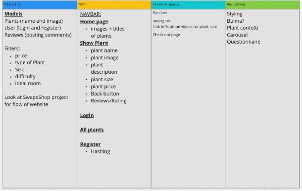
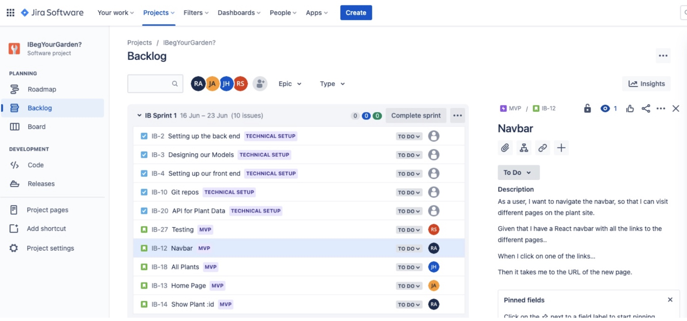
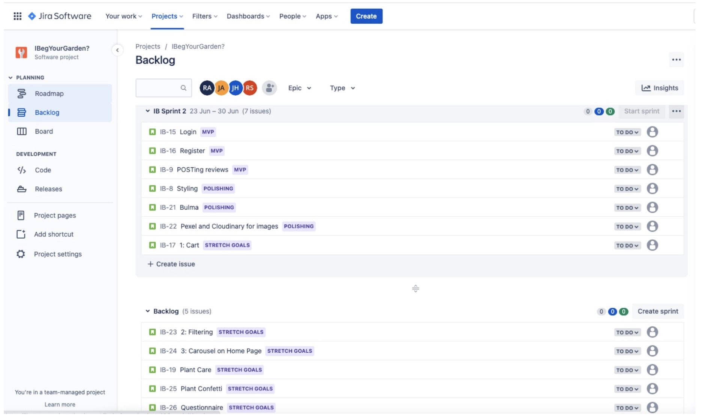

#  I Beg Your Garden?! 
### Developers
Robyn Smith, Jaewon Han, Roshanak Ahmed, and Jeanzle Albalte

## Overview
This is an E-commerce React app project that sells plants. The developers built a plant API with back-end endpoints and connected it to React routes on a front-end proxy server. 

Additional components were created such as the Home page. Customers can also register user accounts and log into the website on the Register and Login pages. Users then have the option to logout of their accounts.

The Plants page shows all the plants from API. When each individual plant is clicked on, users can see all the individual plant data from the the API on a new page. The API data is inspired by PatchPlants.com.

Logged in users have the option to add comments reviewing each plant. Users may also add plants to their Cart. The admin user is the only user given the option to create new plants and delete existing plants on the Plant page.

The Plant Care page embeds YouTube videos and links external articles on plant care tips. The Questionnaire tab allows users to take a survey and find out which plant type best suits them.

**Technologies**
- Miro and Jira for planning
- Excalidraw for whiteboarding
- Visual Studio Code to create product
- Terminal to install dependencies
- Command Line Tools to install dependencies
- npm I to install dependencies
- Node for database seeding
- React for frontend and backend development
- React-Modal-Video to embed a YouTube video on plant care
- React-Confetti to add confetti to checkout button
- React-Responsive-Carousel to add carousel of recent plant purchases  in home page
- Survey-React to create questionnaire
- API for frontend and backend development
- Insomnia to test our API
- JavaScript and JSX for frontend and backend development
- HTML for frontend development
- CSS for styling in frontend development
-  Bulma to import CSS
- Google Fonts to import fonts for styling
- Cloudinary to upload images into URLs
- Netlify for frontend deployment
- Heroku for backend API deployment
- MongoDB and Mongo Atlas to have a working database to deploy on Heroku
- Github
- Chai, Supertest, and Mocha for testing

**Installation Instructions**
  1. Terminal: run `mongod --dbpath ~/data/db`
  2. Backend: run `node db/seed.js`
  3. Backend: run `npm start`
  4. Frontend: run `npm i`
  5. Frontend: run `npm start`

 **Presentation** 
  - Pitch Deck:
      # 
      # 
- Jira Board:
    # 
    # 
**User Stories** 
      https://docs.google.com/document/d/1CrNyAtkU2yVdQW3Xsw_byXqZwaLLTu99/edit 

 **Unsolved Problems**
Due to time constraints we did not add options for creating a user avatar, ratings on plant reviews, and a cloudinary image for when an admin user adds a new plant.
 
 **Major Hurdles**
We struggled to decide whether to use useState or a ternary for our logout button. We also overcame ensuring that the logout button only appears when a user is logged in.

In addition, we overcame ensuring that the Create Plant page and delete button only appear when the admin user is logged in.

Lastly, we ensured that logged in users can add plants to their cart and that all the plants they add will appear in their specific cart.